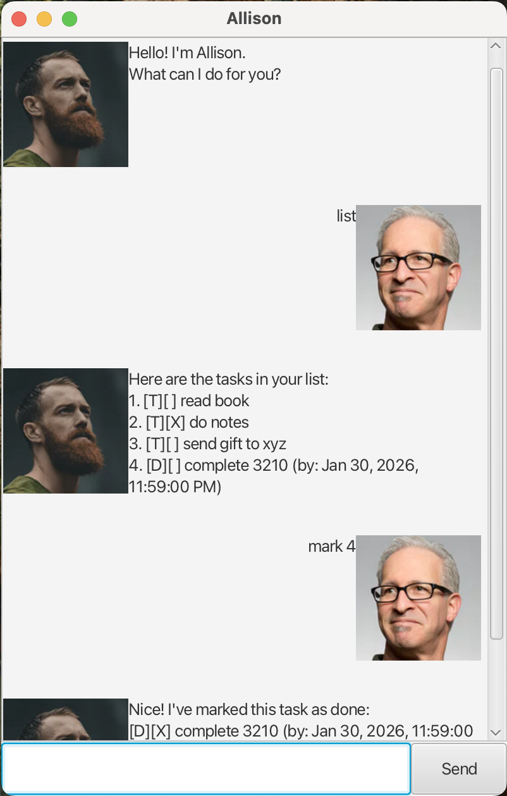

# Allison User Guide

Allison is a **desktop task management app, optimized for use via a Command Line Interface** (CLI)
while still having the benefits of a Graphical User Interface (GUI).
If you can type fast, Allison can help you manage your todos, deadlines, and events faster than
traditional GUI apps.



- [Quick Start](#quick-start)
- [Features](#features)
  - [Viewing help: `help`](#viewing-help--help)
  - [Listing all tasks: `list`](#listing-all-tasks--list)
  - [Adding a todo: `todo`](#adding-a-todo--todo)
  - [Adding a deadline: `deadline`](#adding-a-deadline--deadline)
  - [Adding an event: `event`](#adding-an-event--event)
  - [Marking a task as done: `mark`](#marking-a-task-as-done--mark)
  - [Marking a task as not done: `unmark`](#marking-a-task-as-not-done--unmark)
  - [Deleting a task: `delete`](#deleting-a-task--delete)
  - [Finding tasks by keyword: `find`](#finding-tasks-by-keyword--find)
  - [Exiting the program: `bye`](#exiting-the-program--bye)
  - [Saving the data](#saving-the-data)
- [FAQ](#faq)
- [Command Summary](#command-summary)

---

## Quick Start

1. Ensure you have **Java 17** or above installed on your computer.

2. Download the latest `allison.jar` file from [here](https://github.com/allisonllx/ip/releases).

3. Copy the file to the folder you want to use as the _home folder_ for Allison.

4. Open a command terminal, `cd` into the folder you put the jar file in, and run:
   ```
   java -jar allison.jar
   ```
   A GUI similar to the screenshot above should appear in a few seconds.

5. Type a command in the text box and press **Enter** (or click **Send**) to execute it.

6. Some example commands you can try:
   - `list` : Lists all tasks.
   - `todo read book` : Adds a todo task called "read book".
   - `deadline submit report /by 2024-06-15T14:30` : Adds a deadline task.
   - `delete 1` : Deletes the 1st task in the list.
   - `bye` : Exits the app.

7. Refer to the [Features](#features) section below for details on each command.

---

## Features

> **Notes about the command format:**
>
> - Words in `UPPER_CASE` are parameters to be supplied by the user.
>   e.g. in `todo DESCRIPTION`, `DESCRIPTION` is a parameter: `todo read book`.
>
> - Date/time parameters use the format `YYYY-MM-DDTHH:MM`.
>   e.g. `2024-06-15T14:30` represents 15 June 2024, 2:30 PM.

### Viewing help : `help`

Shows a list of all available commands and their usage.

Format: `help`

### Listing all tasks : `list`

Shows a numbered list of all tasks currently stored.

Format: `list`

Example output:

```
Here are the tasks in your list:
1. [T][ ] read book
2. [D][ ] submit report (by: 15 Jun 2024, 2:30:00 pm)
3. [E][ ] team meeting (from: 15 Jun 2024, 10:00:00 am to: 15 Jun 2024, 12:00:00 pm)
```

### Adding a todo : `todo`

Adds a simple task with no date/time attached.

Format: `todo DESCRIPTION`

Example: `todo read book`

```
Got it. I've added this task:
[T][ ] read book
Now you have 1 tasks in the list.
```

### Adding a deadline : `deadline`

Adds a task with a due date/time.

Format: `deadline DESCRIPTION /by DATE_TIME`

- `DATE_TIME` must be in `YYYY-MM-DDTHH:MM` format.

Example: `deadline submit report /by 2024-06-15T14:30`

```
Got it. I've added this task:
[D][ ] submit report (by: 15 Jun 2024, 2:30:00 pm)
Now you have 2 tasks in the list.
```

### Adding an event : `event`

Adds a task that spans a time period with a start and end date/time.

Format: `event DESCRIPTION /from START_DATE_TIME /to END_DATE_TIME`

- Both `START_DATE_TIME` and `END_DATE_TIME` must be in `YYYY-MM-DDTHH:MM` format.

Example: `event team meeting /from 2024-06-15T10:00 /to 2024-06-15T12:00`

```
Got it. I've added this task:
[E][ ] team meeting (from: 15 Jun 2024, 10:00:00 am to: 15 Jun 2024, 12:00:00 pm)
Now you have 3 tasks in the list.
```

### Marking a task as done : `mark`

Marks the specified task as done.

Format: `mark INDEX`

- Marks the task at the specified `INDEX` as done.
- The index refers to the index number shown in the task list.
- The index **must be a positive integer** 1, 2, 3, ...

Example: `mark 1`

```
Nice! I've marked this task as done:
[T][X] read book
```

### Marking a task as not done : `unmark`

Marks the specified task as not done.

Format: `unmark INDEX`

- The index refers to the index number shown in the task list.
- The index **must be a positive integer** 1, 2, 3, ...

Example: `unmark 1`

```
OK, I've marked this task as not done yet:
[T][ ] read book
```

### Deleting a task : `delete`

Deletes the specified task from the list.

Format: `delete INDEX`

- Deletes the task at the specified `INDEX`.
- The index refers to the index number shown in the task list.
- The index **must be a positive integer** 1, 2, 3, ...

Example: `delete 2`

```
Noted. I've removed this task:
[D][ ] submit report (by: 15 Jun 2024, 2:30:00 pm)
Now you have 2 tasks in the list.
```

### Finding tasks by keyword : `find`

Finds all tasks whose descriptions contain the given keyword.

Format: `find KEYWORD`

- The search is **case-insensitive**. e.g. `book` will match `Book`.
- Only the task description is searched.
- Partial words are matched. e.g. `read` will match `reading`.

Example: `find book`

```
Here are the matching tasks in your list:
1. [T][ ] read book
```

### Exiting the program : `bye`

Exits the application. The window will close after a short delay.

Format: `bye`

### Saving the data

Task data is saved to the hard disk automatically after every command. There is no need to save manually.

The data file is located at `[JAR file location]/data/allison.txt`.

> **Caution:** If you edit the data file manually and the format becomes invalid,
> Allison may discard corrupted entries on the next launch. It is recommended to
> back up the file before editing it directly.

---

## FAQ

**Q: How do I transfer my data to another computer?**

A: Install the app on the other computer and copy the `data/allison.txt` file from your
current home folder to the same location on the new computer.

**Q: What date/time format should I use?**

A: Use `YYYY-MM-DDTHH:MM` format. For example, `2024-06-15T14:30` for 15 June 2024 at 2:30 PM.

---

## Command Summary

| Action     | Format                                                   | Example                                                         |
|------------|----------------------------------------------------------|-----------------------------------------------------------------|
| **Help**   | `help`                                                   | `help`                                                          |
| **List**   | `list`                                                   | `list`                                                          |
| **Todo**   | `todo DESCRIPTION`                                       | `todo read book`                                                |
| **Deadline** | `deadline DESCRIPTION /by DATE_TIME`                   | `deadline submit report /by 2024-06-15T14:30`                   |
| **Event**  | `event DESCRIPTION /from START /to END`                  | `event meeting /from 2024-06-15T10:00 /to 2024-06-15T12:00`    |
| **Mark**   | `mark INDEX`                                             | `mark 1`                                                        |
| **Unmark** | `unmark INDEX`                                           | `unmark 1`                                                      |
| **Delete** | `delete INDEX`                                           | `delete 3`                                                      |
| **Find**   | `find KEYWORD`                                           | `find book`                                                     |
| **Exit**   | `bye`                                                    | `bye`                                                           |
